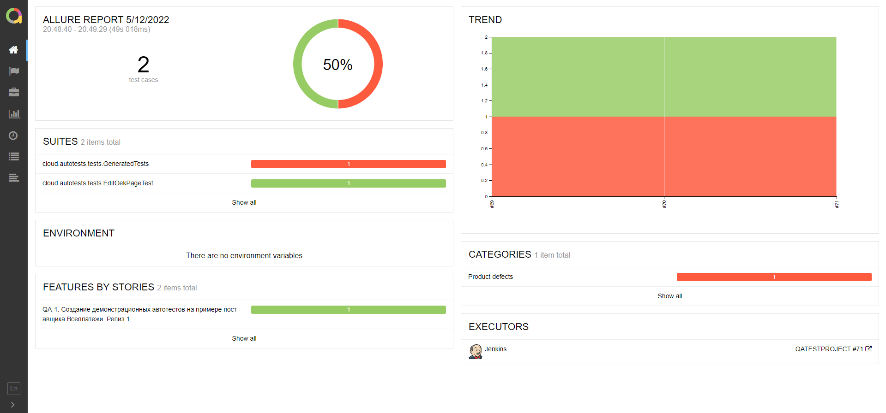
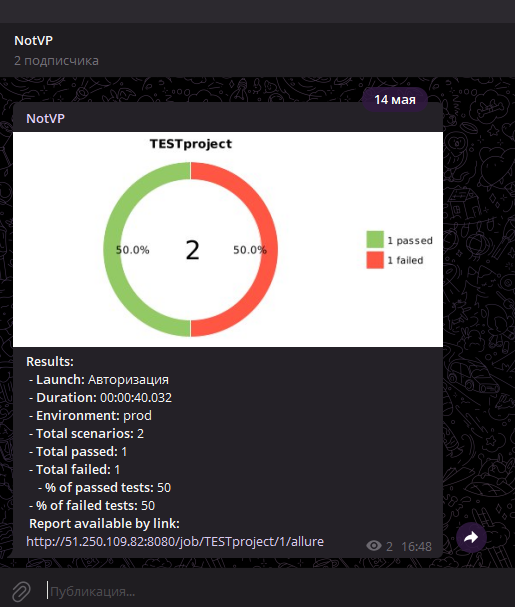

# Демонстрационный проект по автоматизации тестирования сайта ВсеПлатежи
## *ВсеПлатежи — это платежный сервис, с помощью которого можно легко оплачивать ЖКХ, штрафы, налоги и другие услуги, переводить деньги на карту и передавать показания счетчиков.*

## :page_with_curl:	Содержание

> :heavy_check_mark: [Технологии и инструменты](#technologist-технологии-и-инструменты)
>
> :heavy_check_mark: [Реализованы проверки](#bookmark_tabs-реализованы-проверки)
>
> :heavy_check_mark: [Запуск тестов из терминала](#computer-Запуск-тестов-из-терминала)
>
> :heavy_check_mark: [Запуск тестов в Jenkins](#-запуск-тестов-в-jenkins)
>
> :heavy_check_mark: [Отчет о результатах тестирования в Allure Report](#-отчет-о-результатах-тестирования-в-allure-report)
>
> :heavy_check_mark: [Уведомления в Telegram с использованием бота](#-уведомления-в-telegram-с-использованием-бота)
>
> :heavy_check_mark: [Пример запуска теста в Selenoid](#-пример-запуска-теста-в-selenoid)

## :technologist: Технологии и инструменты

<p  align="center"

<code></code>
<code></code>
<code></code>
<code></code>
<code></code>
<code></code>
<code></code>
<code></code>
<code></code>
<code></code>
</p>

> *В данном проекте автотесты написаны на <code><strong>*Java*</strong></code> с использованием фреймворка <code><strong>*Selenide*</strong></code> для UI-тестов.*
>
>*Для сборки проекта используется <code><strong>*Gradle*</strong></code>.*
>
>*<code><strong>*JUnit 5*</strong></code> используется как фреймворк для модульного тестирования.*
>
>*Запуск тестов выполняется из <code><strong>*Jenkins*</strong></code>.*
>
>*<code><strong>*Selenoid*</strong></code> используется для запуска браузеров в контейнерах  <code><strong>*Docker*</strong></code>.*
>
>*<code><strong>*Allure Report, Telegram Bot*</strong></code> используются для визуализации результатов тестирования.*


## :bookmark_tabs: Реализованы проверки

### &nbsp;&nbsp;&nbsp;&nbsp;&nbsp;&nbsp; UI

>- [x] *Проверка ошибок в консоле (негативный тест)*
>- [x] *Проверка редактирования платежа из корзины (позитивный тест)*
        
## :computer: Запуск тестов из терминала 

### Локальный запуск тестов

```bash
gradle clean test
```


##  Запуск тестов в [Jenkins](http://51.250.107.11:8080/login?from=%2F)

+ *Перейдите по ссылке [Jenkins](http://51.250.107.11:8080/login?from=%2F)*
+ *Введите логин ***user****
+ *Введите пароль ***1qaz!QAZ****
+ *[Перейти в QATESTPROJECT](http://51.250.107.11:8080/job/QATESTPROJECT/)*
+ *Для запуска сборки необходимо нажать на кнопку <code><strong>*Собрать с параметрами (Build with Parameters)*</strong></code>.*
+ *Выбрать необходимые параметры*
+ *Нажать на кнопку <code><strong>*Собрать (Build)*</strong></code>.*

> Запуск тестов в Jenkins.
<p align="center">
  
</p>

##  Отчет о результатах тестирования в [Allure Report](http://51.250.107.11:8080/job/QATESTPROJECT/allure/)

### :pushpin: Общая информация

*Главная страница Allure-отчета содержит следующие информационные блоки:*

> - [x] <code><strong>*ALLURE REPORT*</strong></code> - отображает дату и время прохождения теста, общее количество прогнанных кейсов, а также диаграмму с указанием процента и количества успешных, упавших и сломавшихся в процессе выполнения тестов
>- [x] <code><strong>*TREND*</strong></code> - отображает тренд прохождения тестов от сборки к сборке
>- [x] <code><strong>*SUITES*</strong></code> - отображает распределение результатов тестов по тестовым наборам
>- [x] <code><strong>*ENVIRONMENT*</strong></code> - отображает тестовое окружение, на котором запускались тесты (в данном случае информация не задана)
>- [x] <code><strong>*CATEGORIES*</strong></code> - отображает распределение неуспешно прошедших тестов по видам дефектов
>- [x] <code><strong>*FEATURES BY STORIES*</strong></code> - отображает распределение тестов по функционалу, который они проверяют
>- [x] <code><strong>*EXECUTORS*</strong></code> - отображает исполнителя текущей сборки (ссылка на сборку в Jenkins)

<p align="center">
  
</p>


##  Уведомления в Telegram с использованием бота

> После завершения сборки специальный бот, созданный в <code>Telegram</code>, автоматически обрабатывает и отправляет сообщение с отчетом о прогоне тестов в [Telegram канал](https://t.me/+utbhTYmAL7gxZWNi)

<p align="center">

</p>

##  Пример запуска теста в Selenoid

> К каждому тесту в отчете прилагается видео.
<p align="center">
  
</p>


